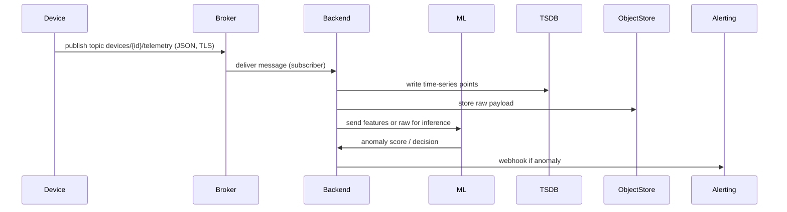

# Système intelligent de surveillance IoT — Document de conception

Date : 2025-11-11
Auteur : Équipe projet

## Résumé
Ce document décrit la conception détaillée du système intelligent de surveillance IoT pour la détection d'anomalies et la cybersécurité des objets connectés. Il contient : architecture, flux de données, contrat de messages, exemples d'ACL pour le broker MQTT, mesures de sécurité, playbooks de réponse aux incidents, et instructions pour produire un PDF à partir du Markdown.

---

## Table des matières
1. Vue d'ensemble
2. Architecture et diagrammes
3. Schéma de messages (contrat)
4. Sécurité & ACLs
5. Pipeline ML et évaluation
6. Playbooks de réponse
7. Déploiement MVP & checklist
8. Annexes (commandes, conversion PDF)

---

## 1. Vue d'ensemble
Objectif : concevoir une plateforme capable de collecter des données depuis des devices (ESP32, Raspberry Pi), d'analyser le comportement normal via des modèles ML, de détecter automatiquement les anomalies (intrusions, trafic suspect) et de fournir des recommandations et actions de sécurité.

Composants principaux :
- Devices (ESP32/RPi) — envoient télémesures via MQTT over TLS (ou HTTPS)
- Broker MQTT sécurisé (Mosquitto/EMQX)
- Gateway edge (optionnelle) pour agrégation/filtrage
- Backend ingestion (FastAPI) — validation, enrichissement, stockage
- TSDB (InfluxDB ou TimescaleDB) + object store pour données brutes
- Pipeline ML (offline training + online inference)
- Dashboard & alerting (Grafana + Alertmanager)
- Response engine / orchestrator (webhooks, scripts d'isolation)

---

## 2. Architecture et diagrammes

### 2.1 Diagramme d'architecture (Mermaid)

```mermaid
flowchart LR
  subgraph Devices
    D1[ESP32-1]
    D2[ESP32-2]
    RPi[Gateway RaspberryPi]
  end

  Devices -->|MQTT/TLS| Broker[MQTT Broker (Mosquitto)]
  Broker --> Backend[Ingestion (FastAPI)]
  Backend --> TSDB[InfluxDB]
  Backend --> ObjectStore[S3/MinIO]
  Backend --> MLWorker[ML Inference Service]
  MLWorker --> Alerting[Alert Webhook / Notification]
  TSDB --> Grafana[Grafana Dashboard]
  Alerting --> Ops[Admin / SIEM]
```

### 2.2 Flux de données (Mermaid)



---

## 3. Schéma de messages (contrat)
Topic recommandé : `devices/{device_id}/telemetry`

Message JSON minimal (RFC3339 timestamp) :

```json
{
  "device_id": "esp32-abc123",
  "ts": "2025-11-11T12:34:56Z",
  "sensors": {"temperature": 22.5, "humidity": 40.3},
  "net": {"tx_bytes": 1024, "rx_bytes": 2048, "connections": 3},
  "meta": {"fw_version": "v1.0.0", "battery": 3.7},
  "sig": "<HMAC-SHA256-base64>"
}
```

Recommandations :
- `ts` obligatoire. Si device non fiable, gateway peut ajouter/normaliser le timestamp.
- Inclure `sig` (HMAC-SHA256) pour garantir intégrité et authenticité si mutual TLS non utilisé.
- QoS MQTT : 1. Retain : false.

---

## 4. Sécurité & ACLs

### 4.1 TLS et authentification
- Utiliser TLS 1.2/1.3 pour MQTT et HTTP(s).
- Préférer mTLS (client certificates) si les devices le supportent.
- Alternativement, username/password + ACLs et HMAC sur payloads.

### 4.2 Exemple de configuration Mosquitto (extraits)
`mosquitto.conf` (extraits pertinents):

```
listener 8883
protocol mqtt
cafile /mosquitto/config/ca.crt
certfile /mosquitto/config/server.crt
keyfile /mosquitto/config/server.key
require_certificate true  # true pour mTLS, false si pas de mTLS
allow_anonymous false
password_file /mosquitto/config/passwords
acl_file /mosquitto/config/aclfile
```

### 4.3 Exemple de fichier ACL (format Mosquitto)
```
# allow device to publish to its own topic and subscribe to commands
user esp32-abc123
topic write devices/esp32-abc123/telemetry
topic read devices/esp32-abc123/commands

# admin user full access
user admin
topic readwrite #
```

Notes :
- Implémenter ACLs fines par device. Utiliser tooling pour générer/mettre à jour ACLs automatiquement.
- Limiter accès à topics sensibles (ex: broker management).

### 4.4 Validation côté serveur
- Utiliser validation JSON (pydantic) pour rejeter messages malformés.
- Vérifier HMAC/signature avant ingestion.

---

## 5. Pipeline ML et évaluation

### 5.1 Approche recommandée
- Baseline non-supervisée : IsolationForest (scikit-learn) pour première itération.
- Second stade : Autoencoder (PyTorch) pour reconstruction error sur vecteurs temporels.
- Pour séquences longues : LSTM/Transformer-based sequence model.

### 5.2 Features initiales
- Moyenne, écart-type, max/min de capteurs sur fenêtre sliding (30s, 5min)
- Delta du trafic (bytes/sec)
- Nombre de connexions ouvertes / minute
- Entropie des endpoints contactés
- Reboots fréquents, perte de heartbeat

### 5.3 Evaluation
- Mètriques si labels : precision/recall/F1, ROC-AUC
- Sinon : analyser taux de falses positives, délai de détection
- Validation temporelle (train sur t0..tN, test sur tN+1..tN+k)

---

## 6. Playbooks de réponse (exemples)

### 6.1 Playbook — Anomalie critique (score élevé)
Objectif : réduire impact, collecter preuves, restaurer état sûr.

Étapes :
1. Enregistrer l'incident (timestamp, device_id, score, raw payload).
2. Isoler le device :
   - Mettre à jour ACL sur broker pour bloquer 'devices/{id}/#' (ex : ajouter deny rule) OU
   - Appliquer règle firewall via orchestrator (block IP du device) OU
   - Si device sur VLAN, déplacer/mettre en quarantaine (via SDN)
3. Collecte forensique : récupérer logs recent, snapshot du object store, capture réseau (pcap) si possible.
4. Révoquer/rotater les identifiants du device (certificat, key, credentials).
5. Préparer un patch ou plan d'intervention (mise à jour firmware si vulnérabilité connue).
6. Notifier administrateurs (email/Slack) et documenter dans le ticketing system (JIRA, Gitlab issue).
7. Après investigation : réintégrer device (après validation), ou retirer définitivement.

### 6.2 Playbook — Scanning / Reconnaissance détecté
1. Augmenter taux de logging pour le device/source.
2. Appliquer throttling sur topics et limiter connexions.
3. Bloquer IP si pattern malveillant confirmé.
4. Rechercher devices similaires (même fw_version, même pattern) pour détection en masse.

### 6.3 Playbook — Data exfiltration suspectée
1. Capturer flux réseau et estimer volume exfiltré.
2. Isoler et désactiver canaux externes (ex : bloquer sortie HTTP pour ce device).
3. Lancer processus de remédiation et conserver artefacts pour forensic.

---

## 7. Déploiement MVP & checklist
Objectif : démonstration en environ 2 semaines.

Composants MVP : docker-compose contenant : Mosquitto (TLS), InfluxDB, Grafana, Backend (FastAPI), ML worker (python script), simulateur device.

Checklist rapide :
- [ ] Générer certificats self-signed pour dev
- [ ] Config Mosquitto avec ACLs minimales
- [ ] Backend : endpoint /predict, abonner au topic
- [ ] ML : script train/infer (IsolationForest)
- [ ] Grafana : dashboard base + alert webhook
- [ ] Simulateur : publish patterns normaux et anomalies

---

## 8. Annexes — commandes et conversion PDF

### 8.1 Convertir ce Markdown en PDF (Windows PowerShell)
Requis : Pandoc (+ un moteur LaTeX comme TinyTex/MiKTeX) ou wkhtmltopdf.

Exemple (avec pandoc + pdflatex) :

```powershell
# installer pandoc (https://pandoc.org/installing.html)
# installer MiKTeX ou TinyTex
pandoc .\design\Design_Documentation.md -o .\design\Design_Documentation.pdf --pdf-engine=pdflatex
```

Si vous préférez HTML->PDF via wkhtmltopdf :
```powershell
pandoc .\design\Design_Documentation.md -o .\design\Design_Documentation.html
wkhtmltopdf .\design\Design_Documentation.html .\design\Design_Documentation.pdf
```

---

## Annexes techniques (snippets utiles)
### HMAC-SHA256 (python) payload signing
```python
import hmac, hashlib, base64
sig = base64.b64encode(hmac.new(secret, payload_bytes, hashlib.sha256).digest()).decode()
```

### Exemples d'outils/datasets pour ML
- Bot-IoT, ToN_IoT, UNSW-NB15, CICIDS.

---

## Prochaines étapes proposées
- Valider ce document et demander modifications.
- Générer diagrammes PNG/SVG (si souhaité) et intégrer dans le Markdown.
- Optionnel : je peux tenter de convertir en PDF ici si vous voulez (prévenez si pandoc/LaTeX est installé sur votre machine) ou je fournis la commande.

---

Fin du document.
