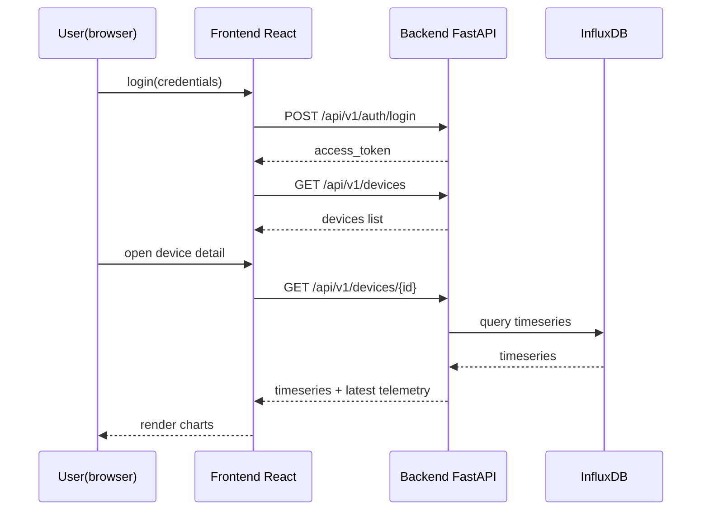
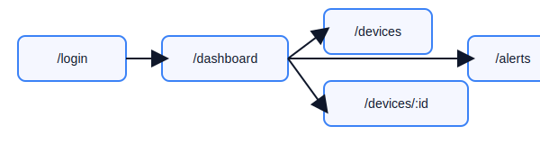

# Webapp — Contrat d'API & Wireframes UI

Date : 2025-11-11

Ce document décrit le contrat d'API pour la webapp de surveillance IoT, les modèles Pydantic (Python), et des wireframes UI en Mermaid pour guider l'implémentation frontend (React + Vite).

## 1) Conventions générales
- Toutes les API REST utilisent JSON. Content-Type: application/json.
- Auth : JWT (access token court, refresh token long). Endpoints protégés nécessitent header `Authorization: Bearer <access_token>`.
- Pagination : standard `?limit=50&offset=0`.
- Time format : RFC3339 UTC (ex: 2025-11-11T12:34:56Z).
- Erreurs : format standard `{"detail": "...", "code": "..."}`.

## 2) Roles & permissions (RBAC)
- roles: `admin`, `operator`, `viewer`.
- `admin` : full access (manage devices, users, ACLs)
- `operator` : acknowledge alerts, quarantine devices
- `viewer` : read-only dashboards and device details

## 3) Models Pydantic (extraits)

Python (pydantic v1/v2 compatible style) :

```python
from pydantic import BaseModel, Field
from typing import Optional, Dict, Any, List
from datetime import datetime

class AuthRequest(BaseModel):
    username: str
    password: str

class AuthResponse(BaseModel):
    access_token: str
    refresh_token: str
    token_type: str = "bearer"

class Device(BaseModel):
    device_id: str
    name: Optional[str]
    fw_version: Optional[str]
    last_seen: Optional[datetime]
    tags: Optional[List[str]] = []

class TelemetrySensors(BaseModel):
    temperature: Optional[float]
    humidity: Optional[float]
    # add more

class TelemetryNet(BaseModel):
    tx_bytes: int
    rx_bytes: int
    connections: int

class Telemetry(BaseModel):
    device_id: str
    ts: datetime
    sensors: Optional[TelemetrySensors]
    net: Optional[TelemetryNet]
    meta: Optional[Dict[str, Any]]
    sig: Optional[str]

class Alert(BaseModel):
    alert_id: str
    device_id: str
    ts: datetime
    severity: str  # low, medium, high, critical
    score: float
    reason: Optional[str]
    acknowledged: bool = False
    metadata: Optional[Dict[str, Any]]
```

## 4) Endpoints (contract)

Auth:
- POST /api/v1/auth/login
  - body: `AuthRequest`
  - resp: `AuthResponse`
  - errors: 401 invalid credentials

- POST /api/v1/auth/refresh
  - body: `{ "refresh_token": "..." }`
  - resp: `AuthResponse`

Devices:
- GET /api/v1/devices
  - query: `limit, offset, tag`
  - resp: list[Device]

- GET /api/v1/devices/{device_id}
  - resp: `Device`

- POST /api/v1/devices
  - body: `Device` (admin only)

Telemetry & Ingest:
- POST /api/v1/telemetry
  - Accepts device telemetry (HTTP fallback if device cannot use MQTT)
  - body: `Telemetry`
  - resp: 202 accepted

- Webhook for MQTT worker -> POST /api/v1/telemetry/internal
  - internal use between MQTT consumer and ingestion pipeline

Alerts:
- GET /api/v1/alerts
  - query: `severity, acknowledged, limit, offset`
  - resp: list[Alert]

- POST /api/v1/alerts/{alert_id}/ack
  - marks acknowledged (operator+)

ML & Prediction:
- POST /api/v1/predict
  - body: `Telemetry` or precomputed features
  - resp: `{ "score": float, "is_anomaly": bool, "threshold": float }`

Admin / Actions:
- POST /api/v1/devices/{device_id}/quarantine
  - body: `{ "duration_minutes": 60, "reason": "suspicious traffic" }`
  - effect: triggers automation to limit ACLs/firewall

Health & Metrics:
- GET /api/v1/health
  - resp: {"status":"ok","components":{"mqtt":"ok","influx":"ok"}}

## 5) Examples JSON

Telemetry example (HTTP ingest):

```json
{
  "device_id": "esp32-abc123",
  "ts": "2025-11-11T12:34:56Z",
  "sensors": {"temperature": 22.5, "humidity": 40.3},
  "net": {"tx_bytes": 1024, "rx_bytes": 2048, "connections": 3},
  "meta": {"fw_version": "v1.0.0", "battery": 3.7},
  "sig": "<HMAC-SHA256-base64>"
}
```

Predict example request (features):

```json
{
  "device_id": "esp32-abc123",
  "ts": "2025-11-11T12:35:00Z",
  "features": { "tx_rate": 12.4, "mean_temp": 22.1 }
}
```

Predict response:

```json
{
  "score": 0.87,
  "is_anomaly": true,
  "threshold": 0.7
}
```

## 6) UI wireframes & routes (Mermaid)

### 6.1 App routes (React)

```mermaid
flowchart TD
  A[/login] --> B[/dashboard]
  B --> C[/devices]
  C --> D[/devices/:device_id]
  B --> E[/alerts]
  B --> F[/admin]
```

### 6.2 Page layout (Dashboard -> Device flow)



### 6.3 Wireframe notes
- Dashboard: cards (total devices, anomalies last 24h, critical alerts), recent alerts list, quick actions.
- Devices page: searchable list, status indicator (green/yellow/red based on last_seen and active alerts).
- Device detail: timeseries charts (temperature, tx_bytes), recent telemetry table, "Quarantine" button, link to raw payload.
- Alerts page: sortable by severity/time, acknowledge button, drilldown to device.
- Admin: manage devices, users, view ACLs, regenerate certs/keys.

### 6.4 Diagrams (SVG)

Les diagrammes suivants sont fournis sous forme de SVG pour intégration rapide dans le frontend ou la documentation :






## 7) Frontend component suggestions
- LoginForm, PrivateRoute (auth guard), DashboardPage, DevicesPage, DeviceDetailPage, AlertsPage, AdminPage
- Charts: use `react-chartjs-2` or `echarts-for-react` for time-series.
- State management: small app can use React Context + hooks; scale -> Redux or Zustand.

## 8) API versioning & backward compatibility
- Prefix all routes with `/api/v1/`.
- Support feature flags for new telemetry fields.

## 9) Rate-limiting & throttling
- Apply per-IP and per-device rate limits on ingestion endpoints (eg 10 req/s per device) using a middleware (Redis-based leaky-bucket).

## 10) Next steps / deliverables
- Validate ce contrat avec vous; ajuster champs et endpoints.
- Si validé, je peux scaffolder le backend FastAPI avec Pydantic models et stub endpoints, puis créer le frontend React skeleton.

---

Fin du document.
